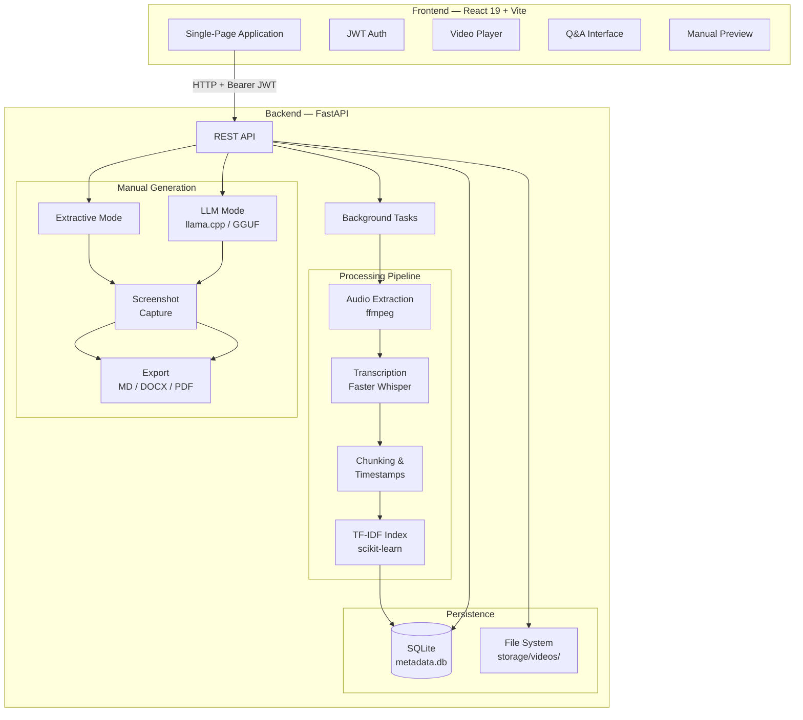
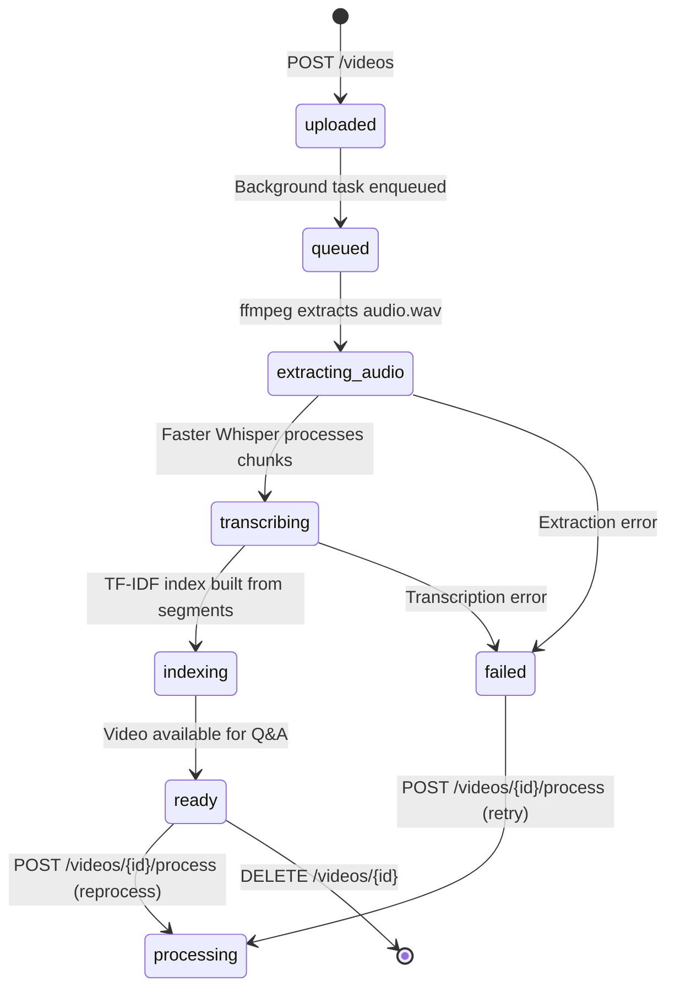
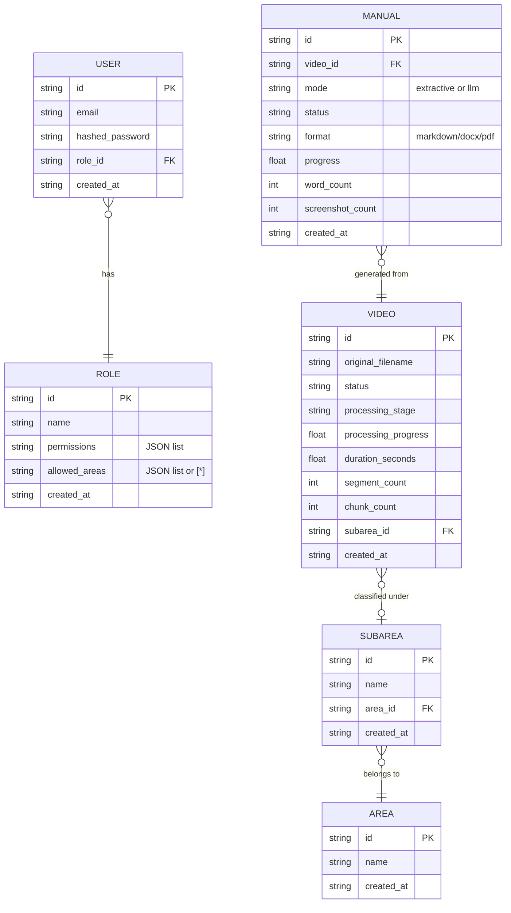
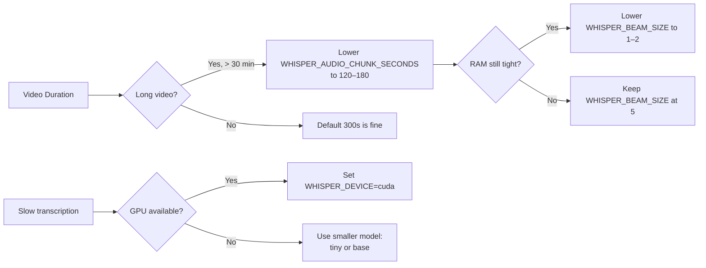
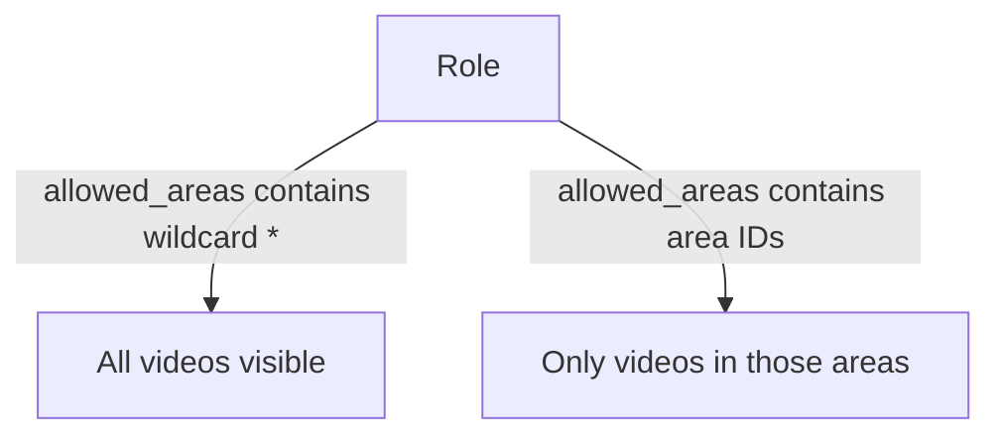

# BMSC AI Video — Intelligent Training Video Platform

An on-premises platform for **Banco Mercantil Santa Cruz** that converts institutional training videos into a searchable, queryable knowledge base and generates operational manuals — entirely offline, with no dependency on cloud AI services.

---

## Table of Contents

1. [Overview](#overview)
2. [Architecture](#architecture)
3. [Processing Pipeline](#processing-pipeline)
4. [Data Model](#data-model)
5. [Tech Stack](#tech-stack)
6. [Project Structure](#project-structure)
7. [Getting Started](#getting-started)
8. [Configuration Reference](#configuration-reference)
9. [API Overview](#api-overview)
10. [Role & Permission Model](#role--permission-model)

---

## Overview

BMSC AI Video ingests video files (MP4, MKV, and common audio/video formats), extracts and transcribes the audio locally using **Faster Whisper**, builds a **TF-IDF** search index over the transcript, and exposes a REST API consumed by a React single-page application.

Key capabilities:

| Capability | Description |
|---|---|
| Local transcription | Faster Whisper runs fully on-prem (CPU or GPU) |
| Semantic search | TF-IDF + cosine similarity with timestamped citations |
| Extractive Q&A | Natural language questions answered with transcript excerpts and exact timecodes |
| Manual generation | Produces Markdown / DOCX / PDF operational manuals from videos (extractive or LLM-assisted via llama.cpp) |
| Screenshot capture | Automatically embeds video frames into generated manuals |
| Role-based access | Granular permissions scoped to organizational areas |

---

## Architecture



---

## Processing Pipeline

When a video is uploaded, it moves through the following stages asynchronously:



Progress is reported incrementally via `processing_progress` (0–100) and `transcribed_timecode` fields on the video metadata resource.

---

## Data Model



---

## Tech Stack

### Backend

| Component | Technology |
|---|---|
| Framework | FastAPI 0.111+ |
| ASGI Server | Uvicorn |
| Database | SQLite via SQLAlchemy 2.0 |
| ASR / Transcription | faster-whisper 1.0+ |
| Audio extraction | ffmpeg (system binary) + imageio-ffmpeg |
| Search index | scikit-learn TF-IDF + cosine similarity |
| LLM inference | llama-cpp-python (optional, GGUF models) |
| Authentication | JWT (PyJWT) + bcrypt password hashing |
| Document export | python-docx (DOCX), reportlab (PDF) |
| Python version | 3.10+ |

### Frontend

| Component | Technology |
|---|---|
| Framework | React 19 |
| Build tool | Vite 8 |
| Routing | React Router DOM v6 |
| Icons | lucide-react |
| Styling | Plain CSS files co-located with each component |
| State | Context API + custom hooks + service layer |
| Auth | Bearer JWT stored in `localStorage` (`bmsc_token`) |

---

## Project Structure

```
BMSC-AI-Video/
├── backend/
│   ├── app/
│   │   ├── main.py               # FastAPI app, startup, all route registrations
│   │   ├── config.py             # Settings from environment variables
│   │   ├── auth.py               # JWT issuance & verification, password hashing
│   │   ├── db_models.py          # SQLAlchemy ORM models
│   │   ├── database.py           # Engine & session factory
│   │   ├── models.py             # Pydantic request/response schemas
│   │   ├── service.py            # Orchestration layer (use-case logic)
│   │   ├── transcription.py      # ffmpeg audio extraction + Faster Whisper
│   │   ├── chunking.py           # Segment grouping with timestamps
│   │   ├── search.py             # TF-IDF index & cosine similarity queries
│   │   ├── answering.py          # Extractive Q&A response assembly
│   │   ├── manual_generation.py  # Extractive & LLM manual generation
│   │   ├── manual_exports.py     # Export to DOCX / PDF
│   │   ├── screenshots.py        # Frame capture from video
│   │   ├── storage.py            # File system persistence helpers
│   │   ├── timecodes.py          # Timecode formatting utilities
│   │   └── routers/              # Auth, areas, users, roles sub-routers
│   ├── models/                   # GGUF model files (gitignored)
│   ├── storage/                  # Video files, audio, transcripts, manuals
│   ├── tests/                    # pytest unit & integration tests
│   ├── requirements.txt
│   ├── .env.example
│   └── run_backend.ps1           # Windows PowerShell launcher
└── frontend/
    ├── src/
    │   ├── main.jsx              # Entry point: BrowserRouter + App
    │   ├── App.jsx               # Route definitions + Context providers
    │   ├── config/
    │   │   └── env.js            # API_BASE_URL from VITE_API_BASE_URL
    │   ├── constants/
    │   │   └── labels.js         # Status labels, availablePermissions
    │   ├── utils/
    │   │   ├── cx.js             # classnames helper
    │   │   ├── format.js         # formatSeconds, formatDate, formatDateTime
    │   │   └── markdown.js       # parseMarkdown, renderInlineMarkdown
    │   ├── services/             # All backend communication
    │   │   ├── apiClient.js      # apiRequest() — token injection, 401 handling
    │   │   ├── auth.js           # login, getCurrentUser
    │   │   ├── videos.js         # CRUD, process, index, transcript, ask, mediaUrl
    │   │   ├── manuals.js        # generate, preview, download, delete
    │   │   ├── areas.js          # listAreas, createArea, createSubarea
    │   │   ├── roles.js          # listRoles, createRole, updateRole
    │   │   └── users.js          # listUsers, createUser
    │   ├── context/
    │   │   ├── AuthContext.jsx   # token, currentUser, login, logout, hasPermission
    │   │   ├── VideosContext.jsx  # videos list + 4s polling
    │   │   └── AreasContext.jsx  # areas + initial load
    │   ├── hooks/
    │   │   ├── useManuals.js     # manuals + 5s polling + preview refresh
    │   │   ├── useRoles.js       # roles list
    │   │   └── useUsers.js       # users list
    │   ├── components/
    │   │   ├── layout/           # AppLayout, Sidebar, Topbar (+ .css)
    │   │   ├── routing/          # ProtectedRoute, RequirePermission
    │   │   ├── common/           # StatusPill, ProgressBar, EmptyState, ErrorAlert
    │   │   ├── markdown/         # MarkdownDocument
    │   │   ├── video/            # VideoPlayer, TranscriptPanel, AssistantPanel,
    │   │   │                     #   ManualsPanel, VideoSummary
    │   │   └── modals/           # RoleModal, EditVideoModal, DeleteVideoModal,
    │   │                         #   DeleteManualModal (+ .css each)
    │   ├── pages/                # One page per route, each with co-located .css
    │   │   ├── LoginPage.jsx
    │   │   ├── DashboardPage.jsx
    │   │   ├── UploadPage.jsx
    │   │   ├── LibraryPage.jsx
    │   │   ├── OrganizationPage.jsx
    │   │   ├── UsersPage.jsx
    │   │   ├── RolesPage.jsx
    │   │   └── VideoDetailPage.jsx
    │   └── styles/
    │       └── global.css        # CSS variables, resets, shared primitives
    ├── index.html
    ├── vite.config.js            # @ alias → src/, @vitejs/plugin-react
    └── package.json
```

---

## Frontend Architecture

### Route map

| URL | Page | Permission required |
|---|---|---|
| `/login` | LoginPage | — |
| `/` | DashboardPage | `view_dashboard` |
| `/upload` | UploadPage | `view_videos` |
| `/library` | LibraryPage | `view_library` |
| `/organization` | OrganizationPage | `view_organization` |
| `/users` | UsersPage | `view_users` |
| `/roles` | RolesPage | `view_roles` |
| `/videos/:id` | VideoDetailPage | — |

### Conventions

- **`services/`** — every `fetch` call lives here. All go through `apiClient.js` which injects the Bearer token from `localStorage` and reloads on 401.
- **`context/`** — shared state consumed by multiple pages (`AuthContext`, `VideosContext`, `AreasContext`). Video list polling runs at 4 s inside `VideosContext`.
- **`hooks/`** — page-scoped state (`useManuals`, `useRoles`, `useUsers`). Manual list polling runs at 5 s inside `useManuals`.
- **CSS** — `styles/global.css` holds CSS variables and shared primitives; every component has a co-located `.css` file for its own classes. No CSS Modules — class names are global to preserve existing selectors.

### Environment variable

Set `VITE_API_BASE_URL` in a `frontend/.env` file to point at a non-default backend:

```
VITE_API_BASE_URL=http://my-server:8000
```

Defaults to `http://localhost:8000` when the variable is absent.

---

## Getting Started

### Prerequisites

- Python 3.10 or higher
- Node.js 18+ and npm
- `ffmpeg` available in `PATH` (strongly recommended; fallback exists without it)

### Backend Setup

```bash
cd backend
python -m venv .venv
source .venv/bin/activate          # Windows: .\.venv\Scripts\activate
pip install -r requirements.txt
cp .env.example .env
```

Start the server (do **not** use `--reload` in production — it interrupts background transcription tasks):

```bash
# Windows
.\run_backend.ps1

# Linux / macOS
uvicorn app.main:app --port 8000
```

The API will be available at `http://localhost:8000`.
Interactive docs: `http://localhost:8000/docs`

Default admin credentials seeded on first startup:

| Field | Value |
|---|---|
| Email | `admin@bmsc.com.bo` |
| Password | `admin123` |

### Frontend Setup

```bash
cd frontend
npm install
npm run dev
```

The application will be available at `http://localhost:5173`.

---

## Configuration Reference

All settings are read from `backend/.env`. See `.env.example` for a full template.

| Variable | Default | Description |
|---|---|---|
| `VIDEO_STORAGE_DIR` | `./storage` | Directory for video files, audio, and indexes |
| `FFMPEG_BIN` | `ffmpeg` | Explicit path to ffmpeg binary |
| `WHISPER_MODEL` | `base` | Whisper model size: `tiny`, `base`, `small`, `medium`, `large-v3` |
| `WHISPER_DEVICE` | `cpu` | `cpu` or `cuda` |
| `WHISPER_COMPUTE_TYPE` | `int8` | `int8`, `float16`, `float32` |
| `WHISPER_LANGUAGE` | *(auto-detect)* | Force language code (e.g. `es`) |
| `WHISPER_AUDIO_CHUNK_SECONDS` | `300` | Audio chunk size to limit RAM usage |
| `WHISPER_BEAM_SIZE` | `5` | Beam search width (lower = faster, less accurate) |
| `SEARCH_CHUNK_SECONDS` | `14` | Transcript segment length for search index |
| `SEARCH_CHUNK_MAX_CHARS` | `320` | Maximum characters per search chunk |
| `LLM_PROVIDER` | `llama_cpp` | Local LLM provider. Only `llama_cpp` is supported. |
| `LLM_MODEL_PATH` | *(none)* | Path to local GGUF model file |
| `LLM_N_GPU_LAYERS` | `-1` | GPU layers for llama.cpp (`-1` = auto) |
| `CORS_ORIGINS` | `http://localhost:5173,...` | Comma-separated allowed origins |

### Memory & Performance Guidance



---

## API Overview

All endpoints except `GET /health` require `Authorization: Bearer <token>`.

### Authentication

| Method | Path | Description |
|---|---|---|
| `POST` | `/auth/token` | Obtain JWT access token |
| `GET` | `/auth/me` | Current authenticated user profile |

### Videos

| Method | Path | Description |
|---|---|---|
| `POST` | `/videos` | Upload a video; processing starts in background |
| `GET` | `/videos` | List all videos (filtered by role's allowed areas) |
| `GET` | `/videos/{id}` | Get video metadata and processing progress |
| `PUT` | `/videos/{id}` | Update filename or area assignment |
| `DELETE` | `/videos/{id}` | Delete video and all associated data |
| `GET` | `/videos/{id}/media` | Stream original video file |
| `GET` | `/videos/{id}/transcript` | Full timestamped transcript |
| `POST` | `/videos/{id}/process` | Reprocess (re-transcribe) a video |
| `POST` | `/videos/{id}/index` | Rebuild TF-IDF index without re-transcribing |
| `POST` | `/videos/{id}/query` | TF-IDF search query with top-k results and timecodes |
| `POST` | `/videos/{id}/ask` | Natural language question with extractive answer |

### Manuals

| Method | Path | Description |
|---|---|---|
| `POST` | `/videos/{id}/manuals` | Generate a new manual (extractive or LLM) |
| `GET` | `/videos/{id}/manuals` | List manuals for a video |
| `GET` | `/videos/{id}/manuals/{mid}` | Manual metadata (add `?include_content=true` for body) |
| `GET` | `/videos/{id}/manuals/{mid}/download` | Download as `markdown`, `docx`, or `pdf` |
| `DELETE` | `/videos/{id}/manuals/{mid}` | Delete a manual |

### Organization, Users & Roles

| Method | Path | Description |
|---|---|---|
| `GET/POST` | `/areas` | List or create areas |
| `POST` | `/areas/{id}/subareas` | Add a subarea to an area |
| `GET/POST` | `/users` | List or create users |
| `GET/POST` | `/roles` | List or create roles |
| `PUT` | `/roles/{id}` | Update role permissions and area access |
| `GET` | `/system/dependencies` | Check ffmpeg availability and version |

---

## Role & Permission Model

Roles define two orthogonal dimensions of access:

**System permissions** — what actions a user can perform:

```
view_dashboard      view_videos         view_library
view_organization   view_users          view_roles
upload_video        generate_manual     manage_organization
manage_users        manage_roles
```

**Area access** — which organizational areas' videos are visible:



The default **Super Admin** role is created automatically on first startup with all permissions and global area access.
